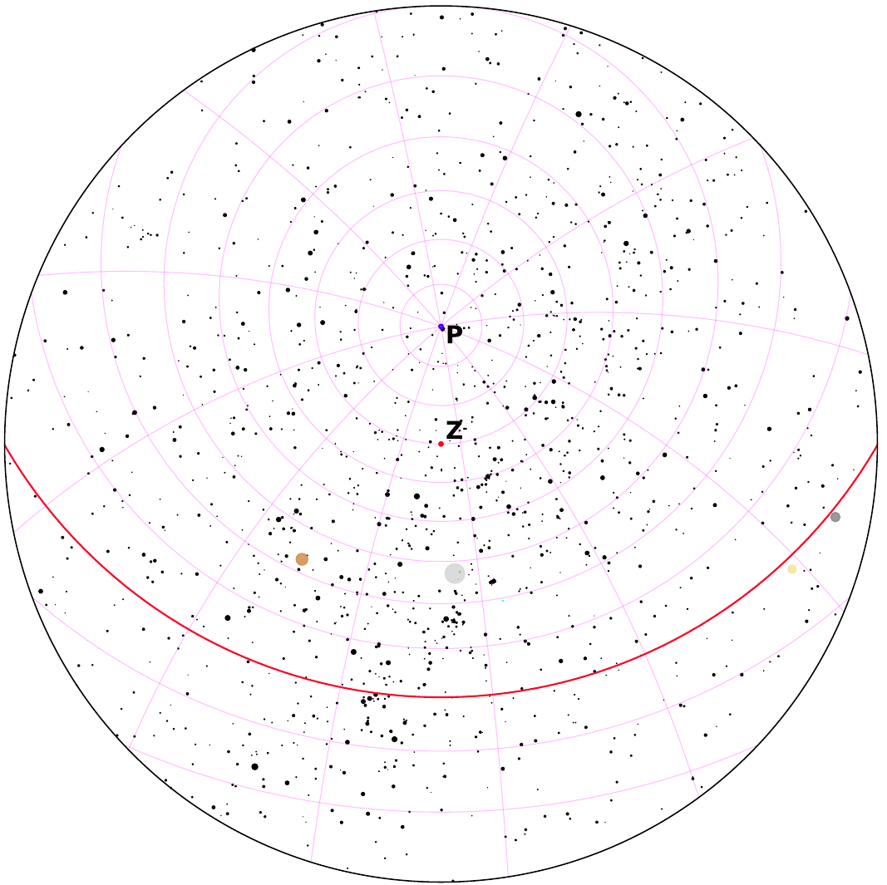
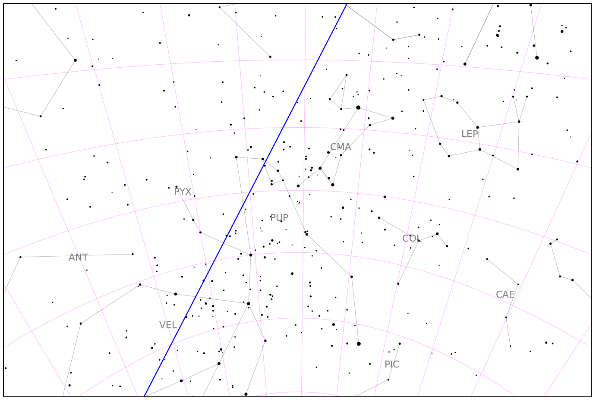
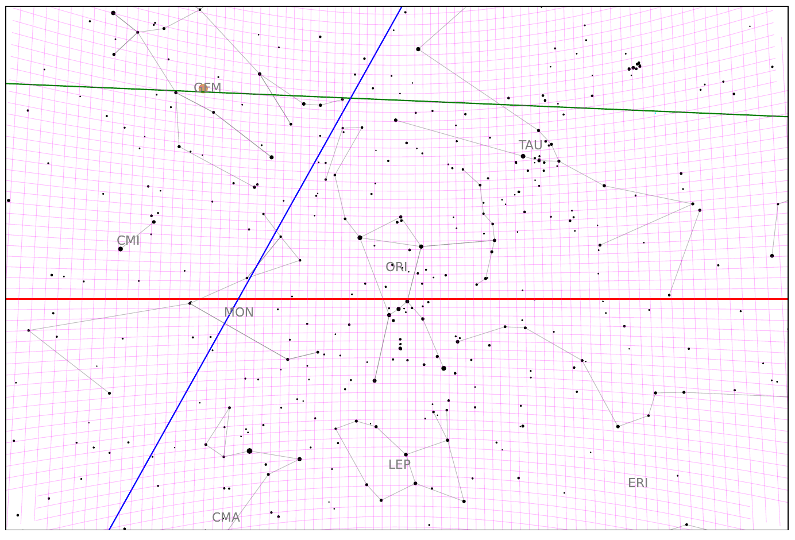
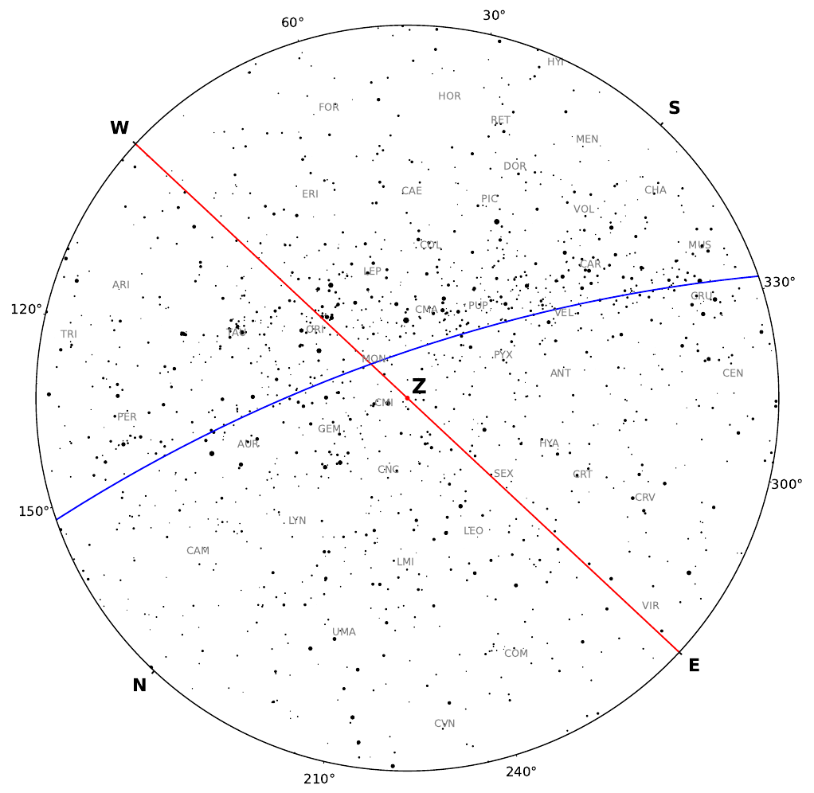

Quickstart
==========

After installation, the ``astrageek`` command becomes available in your terminal.

About
-----

.. code-block:: bash

   astrageek --help

Example 1: Stereographic sky map
--------------------------------

.. code-block:: bash

   astrageek stereographic -lat 60 -lon 10 --add-planets --add-equatorial-grid --add-poles --add-equator --add-zenith --grid-steps 10 15 --output "example"

This produces a map with the following properties:

- Observer location: 60°N, 10°E
- Planets, celestial poles and zenith are marked
- Celestial equator is shown
- Equatorial coordinate grid with 10° declination step and 15° right ascension step
- Output saved as ``example.pdf`` in the current directory

:download:`Download full resolution PDF <_static/examples/example_1.pdf>`

Example 2: Pinhole projection with random direction
---------------------------------------------------

.. code-block:: bash

   astrageek pinhole --mode teacher -t '13.02.2026 00:00' --add-equatorial-grid --grid-steps 10 10 --random-direction

This produces a pinhole sky map with the following properties:

- **Teacher mode preset**: ecliptic, celestial equator, galactic equator, planets, constellation lines and labels are shown
- Date and time: February 13, 2026, midnight
- Equatorial coordinate grid with 10° step on both axes
- Camera points in a **random sky direction**

:download:`Download full resolution PDF <_static/examples/example_2.pdf>`

Example 3: Pinhole projection toward Orion
------------------------------------------

.. code-block:: bash

   astrageek pinhole --mode teacher -t '13.02.2026 00:00' --grid-steps 1 1 --constellation ORI

This produces a pinhole sky map with the following properties:

- **Teacher mode preset**: ecliptic, celestial equator, galactic equator, planets, constellation lines and labels are shown
- Date and time: February 13, 2026, midnight
- Equatorial coordinate grid with 1° step on both axes
- Camera points **toward the Orion** constellation (IAU code: ORI)

:download:`Download full resolution PDF <_static/examples/example_3.pdf>`

Example 4: Stereographic map in student mode with overrides
-----------------------------------------------------------

.. code-block:: bash

   astrageek stereographic --mode teacher --no-equatorial-grid --no-planets --no-constellations --no-ecliptic

This produces a stereographic sky map with the following properties:

- **Default observer location**: 0°N, 0°E
- Base: **teacher mode preset, with selected elements explicitly disabled**
- Equatorial grid, planets, constellation lines and ecliptic are turned off
- Remaining teacher preset elements are active: celestial equator, galactic equator, poles, zenith, ticks

It's useful for producing partially annotated maps for classroom exercises

:download:`Download full resolution PDF <_static/examples/example_4.pdf>`